# Analýza placenty fajčiarok a nefajčiarok

## Ciele projektu

- Zistiť či je možné z placenty určiť:
  - či bola matka fajčiarka
  - ktoré gény sú najviac ovplyvnené fajčením
- Preskúmať možnosti učenia bez učiteľa
- Rekonštruovať chýbajúce kontrolné skupiny

---

# Dáta

## Dataset

- 72 fajčiarok
  - 35 placebo vitamin C
  - 37 vitamin C
- 37 nefajčiarok
- 714 666 záznamov

::: notes
TODO doplniť detailnejší popis datasetu
:::

[Dataset link](https://www.ncbi.nlm.nih.gov/geo/query/acc.cgi?acc=GSE169598)

---

# Skúmané otázky

## Hlavné otázky

- Dá sa z placenty určiť fajčenie matky?
- Ktoré gény sú najviac ovplyvnené?
- Dá sa pomocou clusteringu doplniť chýbajúce rozdelenie?

---

# Feature Selection

## Redukcia dimenzie

1. Low variance filtering

```text
714666 → 20000 features
```

2. Výber featureov

- Sequential Feature Selection
- KBest selector

```text
20000 → 100 features
```

---

# PCA Analýza

## Fajčiari vs nefajčiari

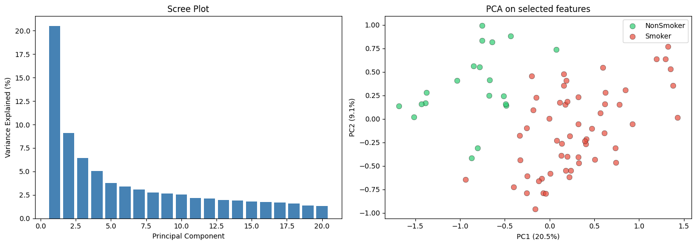

---

# PCA Analýza

## Pohlavie

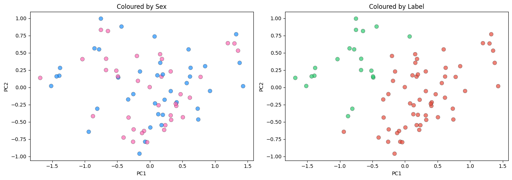

---

# PCA Analýza

## Vek

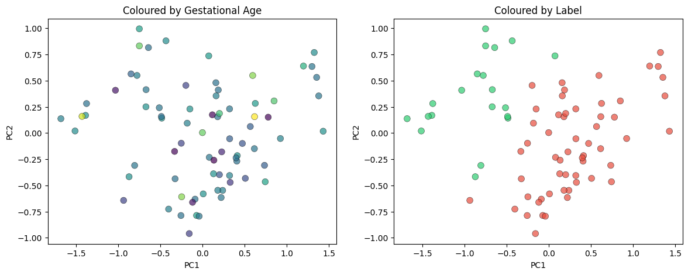

---

# Klasifikátory

## Logistická regresia

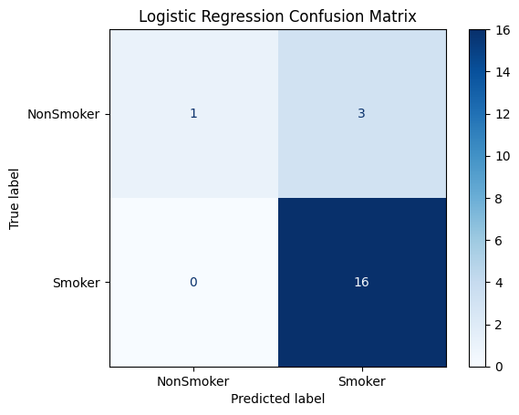

---

# Klasifikátory

## KNN

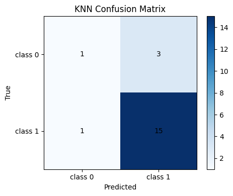

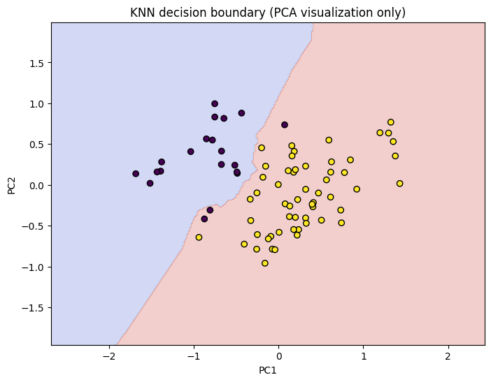

---

# Klasifikátory

## SVM

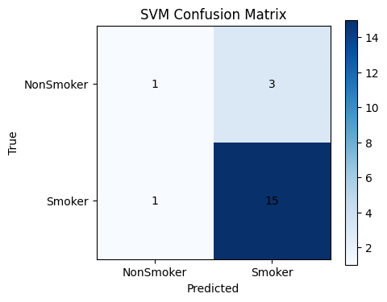

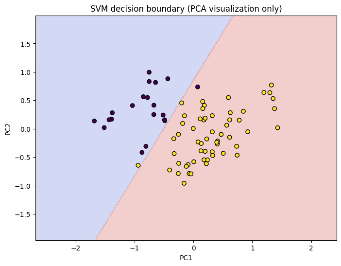

---

# Klasifikátory

## Random Forests

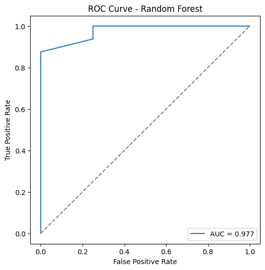

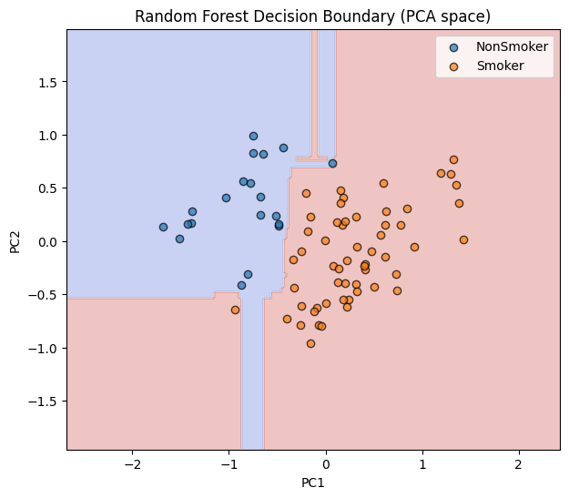

---

# Killer Features

## Najdôležitejšie gény

Použili sme opačný prístup:
hľadali sme featurey najdôležitejšie pri klasifikácii fajčiarok.

---

# Killer Features

## Random Forest Importance

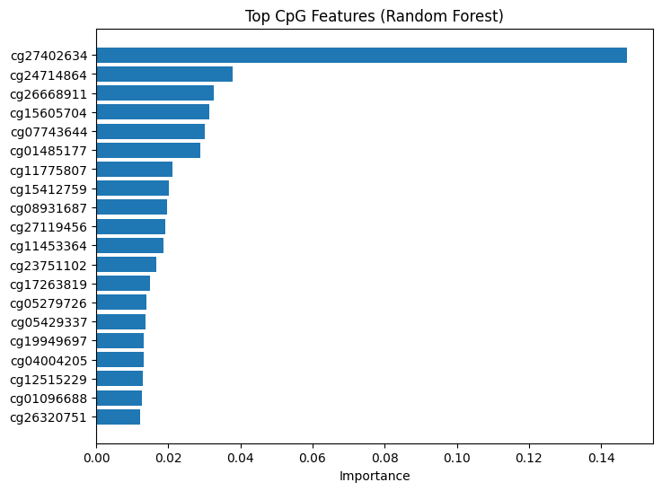

---

# Killer Features

## Sequential Feature Selection

```python
[
 'cg12268888',
 'cg04474990',
 'cg08913726',
 'cg06369090',
 'cg04004205',
 'cg13141983',
 'cg01096688',
 'cg11739758',
 'cg27402634',
 'cg24714864'
]
```

---

# Explainability

## Interpretácia modelov

TODO:
- SHAP
- feature importance
- biologická interpretácia

---

# Unsupervised Learning

## KMeans Clustering

- Algoritmus našiel:
  - 36 vzoriek
  - 36 vzoriek

- Originálne skupiny:
  - 35
  - 37

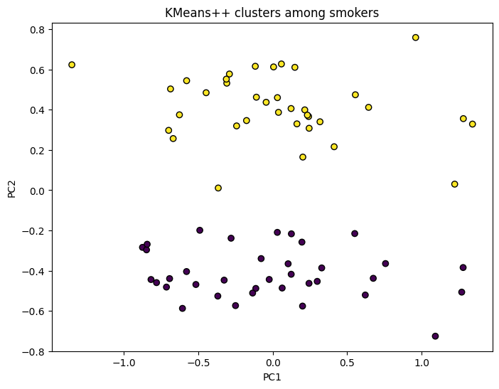

---

# Záver

## Zhrnutie

- Dáta obsahujú silný signál fajčenia
- Viaceré klasifikátory fungovali dobre
- Identifikovali sme potenciálne dôležité gény
- Clustering približne rekonštruoval kontrolné skupiny

# Ďakujeme za pozornosť