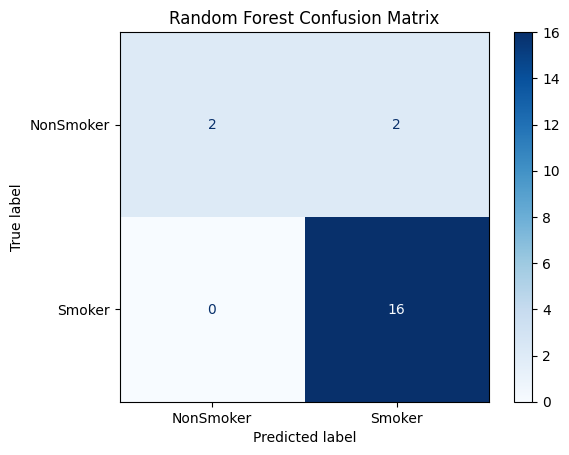
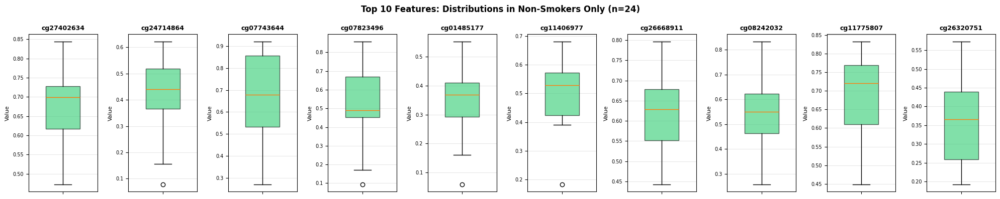
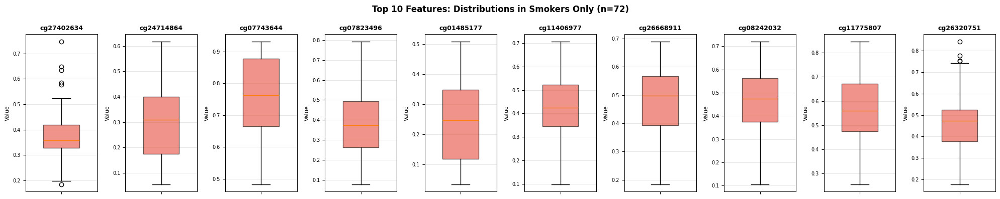

## Analýza placenty fajčiarok a nefajčiarok

### Výskumné otázky

::: {.callout-note}

#### Hlavné otázky projektu

- Dá sa z placenty určiť či matka fajčila?
- Ktoré gény sú najviac ovplyvnené?
- Dá sa rekonštruovať rozdelenie kontrolných skupín?

:::

---

## Dataset

::: columns

::: {.column width="50%"}

### Dáta

- **72 fajčiarok**
  - 35 placebo vitamín C
  - 37 vitamín C

- **37 nefajčiarok**

- **714 666 klasifikačných rysov**

### Metadáta

- Vek
- Pohlavie dieťaťa
- Doba tehotenstva

:::

::: {.column width="50%"}

### Zdroj

[Link na dataset](https://www.ncbi.nlm.nih.gov/geo/query/acc.cgi?acc=GSE169598)

<br>

### Typ dát

- DNA methylácia
- Vzorky placenty
- Vysokodimenzionálne dáta

:::

:::

---

## Feature Selection

### Redukcia dimenzionality

```{mermaid}
flowchart LR
    A[714666 features]
    --> B[Variance cutoff]
    --> C[20000 features]
    --> D[Feature selection]
    --> E[100 features]
```

<br>

### Použité metódy

- Variance cutoff
- KBest Feature Selector
- Sequential Feature Selection
- Logistic Regression

---

## PCA analýza — Fajčiari vs nefajčiari


### Pozorovanie

- Viditeľný efekt fajčenia
- Potenciálna klasifikovateľnosť

---

## PCA analýza — Pohlavie


### Pozorovanie

- Pohlavie nie sú separovateľné
- Pohlavie nesúvisí s metylačným profilom placenty

---

## PCA analýza — Vek


### Pozorovanie

- Vek nevytvára výrazné zhluky
- Malý efekt na metylačný profil


## Logistická regresia

::: columns

::: {.column width="55%"}


### Pozorovania

- Veľmi stabilný model
- Dobrá interpretovateľnosť
- Silný baseline classifier

:::

::: {.column width="45%"}


:::

:::

---

## KNN klasifikátor

::: columns

::: {.column width="50%"}


#### Confusion Matrix

:::

::: {.column width="50%"}


#### PCA projekcia

:::

:::

---

## SVM klasifikátor

::: columns

::: {.column width="50%"}


#### Confusion Matrix

:::

::: {.column width="50%"}


#### PCA projekcia

:::

:::

---

## Random Forests

::: columns

::: {.column width="50%"}



#### Confusion Matrix

:::

::: {.column width="50%"}


#### PCA projekcia

:::

:::

---

## Killer Features

### Najdôležitejšie gény

::: columns

::: {.column width="55%"}


:::

::: {.column width="45%"}

### Sequential feature selection top features

- cg12268888
- cg04474990
- cg08913726
- cg06369090
- **cg04004205**
- cg13141983
- **cg01096688**
- cg11739758
- **cg27402634**
- **cg24714864**

:::

:::

---

## Rozdelenie killer features

::: columns

::: {.row width="50%"}



:::

::: {.row width="50%"}



:::

:::


---

## Unsupervised Learning

### KMeans clustering

::: columns

::: {.column width="50%"}


:::

::: {.column width="50%"}

### Výsledky

- Model našiel:
  - 36 vzoriek
  - 36 vzoriek

<br>

### Originálne skupiny

- 35 placebo
- 37 vitamín C

:::

:::

---

## Záver

::: {.callout-tip}

### Hlavné výsledky

- Dáta umožňujú klasifikáciu
- Random Forests dosiahli najlepšie výsledky
- Identifikovali sme významné gény
- Unsupervised learning možno približne rekonštruoval kontrolné skupiny
- Fajčenie má obojsmerný vplyv na metylačný profil placenty

:::

---

## Ďakujeme za pozornosť

- Patrik Broček
- Rastislav Nowak
